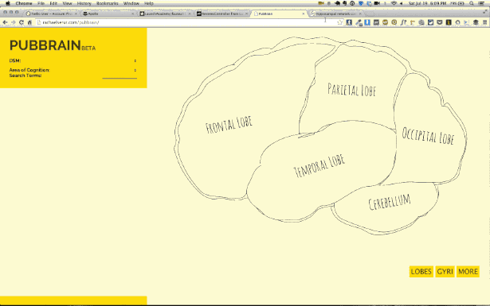

[PubBrain](http://www.rachaelserur.com/pubbrain)
==========
A Spring 2014 Final Project for DGMD-E15, "Creative Explorations in Screen-Based and Physical Computing"

PubBrain is a JavaScript and D3-powered interactive AJAX brain map
that queries a PubMed API for relevant articles.

Copyright © 2014 Rachael A. Serur. See LICENSE for details.
